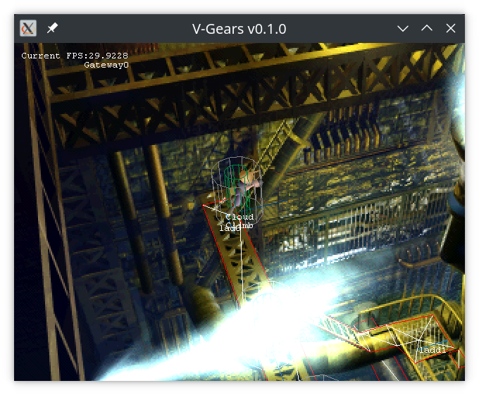

#  V-Gears

## What is V-Gears? 

V-Gears is a free implementation of the game Final Fantasy 7, designed to work with the original game data.

## What is it's current state?

Well, if the question means "How deep into the game can I play?", the answer is "Not much". Exactly until here:

Also, there are no battles, and the world map doesn't work.

But don't worry! The engine is not fixed sequentially, or map by map. Once a fix is implememnted, it applies to all maps at once, anb big chunck of the game are unlocked after each fix.

The field engine is almost completly functional. Once the little quircks in the original game script parser are fixed, all maps should be playable.

## In the meantime...

If it picked your curiosity, you can check out the [history](doc/HISTORY.md "V-Gears history") behind the project. Or, if you want to try it for yourself, maybe the [build](doc/BUILD.md "Building guide") and [installaton](doc/INSTALL.md "Installation guide") guides are a good place to start.

Or even better, if you want to see this done and want to contribute, clone the repo, read the [style guid](doc/STYLE.md "V-Gears C++ Style Guide") and have a go at it!

