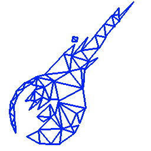

#  V-Gears Building Guide

## Install dependencies
If you are runind Debian (or derivates), you can install the required dependencies by running as root

```bash
apt install g++ cmake libqt5widgets5 qtbase5-dev zlib1g-dev libogre-1.12-dev libois-dev libvorbis-dev libboost-dev libboost-test-dev libboost-filesystem-dev lua5.2 liblua5.2-dev libluabind-dev luajit libopenal-dev libtinyxml-dev
```

## Build using CMake

From the project directory, run these commands:

```bash
mkdir build;
cd build;
cmake ../;
make;
```

If you want to speed it up a bit (it can take several minutes, depending on your system), you can add the parameter `-j` to make to use multiple threads. For instance, `make -j3` will use three cores for the compilation.

Once the build process finishes, you u sholh have the following files (from the project directory):

- `build/bin/v-gears`, the engine executable.
- `build/bin/v-gears-launcher`, the data installer.

Both the engine and the installer are a little pesky about from where they are launched, so before trying to run them, keep reading.

## Next steps

- [Install V-Gears](INSTALL.md "Install V-Gears")
- [Install data](INSTALL_DATA.md "Install Data")
- [Run V-Gears](RUN.md "Run V-Gears")