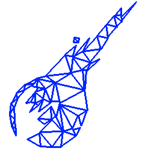

#  V-Gears LUA Style Guide

- *For the C++ Style Guide, see the [V-Gears C++ Style Guide](STYLE.md "C++ Style Guide")*

-----------------------
## TL;DR;

1. Readability over performance.
2. Be consistent whit existing code.
3. When in doubt, use the simplest solution.

## Introduction

While most of the project core is C++, some scripts use LUA as a lenguage. This is a style guide for those scripts.

***Note:*** *This guide applies to manually writen code. Code automatically produced from the installer by parsing the game data should, as much as possible, follow these rules, but it's not mandatory.*

------
## Formatting

**Indentation** - Indenting uses four spaces. Don't use tabs.

```lua
for i,v in ipairs(t) do
    if type(v) == "string" then
        print(v)
    end
end
```

------
## Naming

**Variable name length** - Variable names with larger scope should be more descriptive than those with smaller scope. For example, `i` is probably a poor choice for a global variable in a large program, but it's perfectly fine as a counter in a small loop.

**Variable naming** - Variables holding values or objects must be lowercase and short (e.g. `color`). Multiple words must be separated by underscores (e.g. `front_color`)

**Function naming** - Function names use `PascalCase`.

**Constants naming** - Constants, particularly ones that are simple values, are often given in `ALL_CAPS`, with words separated by underscores.

**Module/package naming** - Module names are all `lowercase`, with nothing between words.

**Class names** Should be `PascalCase`.

------
##Scope

Use locals rather than globals whenever possible.
```lua
local x = 0
local function count()
    x = x + 1
    print(x)
end
```

Globals have larger scopes and lifetimes and therefore increase complexity.

----------
## End terminator

Always use `end` as a block terminator
```lua
for i, v in ipairs(t) do
    if type(v) == "string" then
        -- ...lots of code here...
    end -- if
end -- for
```lua

----------
## Commenting

Use a space after `--`.
```lua
return nil  \-- not found    (suggested)
return nil  \--not found     (discouraged)
```

Kepler sometimes uses this doxygen/Javadoc-like style:

\-- taken from cgilua/src/cgilua/session.lua
\-------------------------------------
\-- Deletes a session.
\-- @param id Session identification.
\-------------------------------------
function delete (id)
        assert (check\_id (id))
        remove (filename (id))
end

----------
## Code Documentation

Document every block of code with JavaDoc-style docstrings, for doxygen, like this:

```lua
--[[
 Retrieves a bit variable.
 @param bank Memory bank (0-index, as in game).
 @param variable Bank address (0-index, as in game).
 @param bit Address bit (0-index, as in game).
 @return 1 or 0
]]
bit = function(bank, variable, bit)
    return BitBanks[bank + 1][variable + 1][bit + 1]
end
```

----------
## Lua Idioms

To test whether a variable is not `nil` in a conditional, it is terser to just write the variable name rather than explicitly compare against `nil`. Lua treats `nil` and `false` as `false` (and all other values as `true`) in a conditional:

```lua
local line = io.read()
if line then  \-- instead of line ~= nil
    -- ...
end
...
if not line then  \-- instead of line == nil
    -- ...
end
```

----------
## Credits

This file is derived from the style guide in [Lua-Users](https://lua-users.org/wiki/LuaStyleGuide"). While some rules are completly different, the document structure, several paragraphs and many examples are original or closely derived.

----------